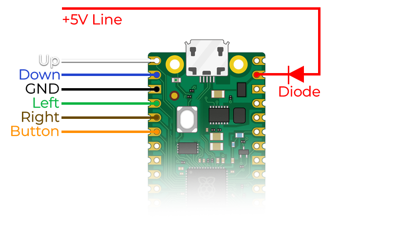

# PicoNtrol - the Pico BT Controller Adapter.
## Overview
PicoNtrol is a Bluetooth Adapter powered by a Raspberry Pi Pico W that plugs straight into the native controller port of supported retro consoles.
PicoNtrol is a WIP hobbyist project in it's very early days designed for enthusiasts who are familiar with electronics and retro gaming hardware.

### Risks and Responsibilities
### ⚠️Warning: Use PicoNtrol at Your Own Risk⚠️

 - **Potential Console Damage:** Incorrect wiring or installation may damage your console. Ensure that you follow the instructions carefully, and double-check all connections before powering on your console. Check the list of [supported hardware below](https://github.com/ShadeReogen/PicoNtrol?tab=readme-ov-file#supported-hardware). Anything not included is no man's land and has not been tried before, by me at least.

 - **User Responsibility:** By using PicoNtrol, you acknowledge and accept the risks associated with modifying your console. Any damage caused to your console or Pico W during the creation, installation or use of PicoNtrol is solely your responsibility.

## Requirements
To create a PicoNtrol adapter you'll need the following:
- Raspberry Pi Pico W
- A controller cable for your console (either aftermarket or scrapped from a controller)
- Soldering equipment
- The `picontrol-<console>.uf2` file to flash onto the Pico W. You can find it in the `Releases` tab.
##  Pinout and Soldering
If you're using a different or aftermarket cable, make sure you connect the correct wireto the correct pin.
I have used [this 9 Pin Mega Drive cable from AliExpress](https://it.aliexpress.com/item/1005006642758218.html?spm=a2g0o.productlist.main.23.3e9bEGleEGle14&algo_pvid=dfa1677c-e244-4ff3-a169-98364c37e02d&utparam-url=scene:search%7Cquery_from:&gatewayAdapt=glo2ita). If you use the same, make sure to check the mapping at the bottom of this post. This cable is ***recommended*** as it has a 5V wire.
For now, we've reprogrammed the pico to support following actions:
|PICO PIN|ACTION|CX40 COLOR|
|--|--|--|
|  0|UP|White|
|1|DOWN|Blue|
|2|GROUND|Black|
|3|LEFT|Green|
|4|RIGHT|Brown|
|5|BUTTON|Orange|
|~~40~~ | ~~+5V~~| ~~RED~~|
> **Note**: You can use any **GND** pin on the Pico W.

Keep in mind that the official CX40 cable does not have a +5V wire. In this case you must power the Pico with a 5V battery or USB, just re-route the GND accordingly **(DIODE MANDATORY IN THIS CASE)**.
> **Note**: The use of a diode is still recommended to avoid accidental power backfeeding to the console the Pico's USB. If you omit it, make sure the USB is **ALWAYS** disconnected before plugging the Pico into the console.

The colors in this image match the ones of an official, original Atari CX40 Joystick and the extra +5V wire.

In case of need, here is the CX40 pinout. The controller cable plug is picture bottom left. 

[Source](https://jamhamster.wordpress.com/2021/07/17/atari-kempston-joystick-pinout-diagram/)

## Installation
Download the `picontrol-<console>.uf2` file from the [`Release`](https://github.com/ShadeReogen/PicoNtrol/releases/tag/v0.2-alpha) tab.
Plug your Pico W into your PC while holding down the BOOTSEL button, and drag the file on the root of the Pico W's storage. Once done the Pico W should disconnect from the PC.
You can now unplug your Pico W.

## Last step
If you're sure you wired everything correctly, you may now plug the cable into the console's controller port.
If you used the recommended cable, the Pico W should boot up as soon as you turn on your console.
⚠️Again, I'm not responsible for any damage you might cause to your hardware⚠️

# Supported Hardware
|Console|Status  |
|--|--|
| Atari 2600 | :white_check_mark: OK|
|NES|:construction: In developement|
#

|Controller  | Atari 2600| NES|
|--|--|--|
| Xbox Series X |:white_check_mark:|:x:|
|Switch Pro|:soon:|:x:|
|DualShock 4|:white_check_mark:|:x:|

> **Note**: After Pairing the DualShock 4, it usually doesn't need to be paired again, unless it has been paired with another device in the meantime.

### Mega Drive 9 Pin Cable AE
I'll leave the AliExpress cable layout here, mostly for myself so I don't need to remember it:
|ACTION|COLOR  | 
|--|--|
| UP | RED |
| DOWN| BLACK|
LEFT|GRAY|
|RIGHT|ORANGE|
|BUTTON|GREEN|
|+5V|WHITE|
|GND|BLUE|
|YELLOW| INPUT B|
|BROWN|INPUT A|

#### Credits
Thanks to project [Bluepad32](https://github.com/ricardoquesada/bluepad32) for their Pico W bluetooth library.
Bluepad32 is used to establish the connection with the controller, they did the hard part.
